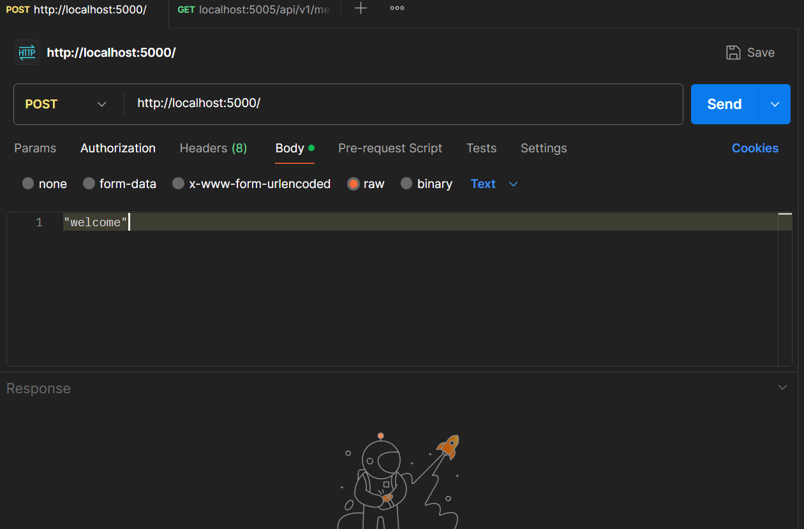
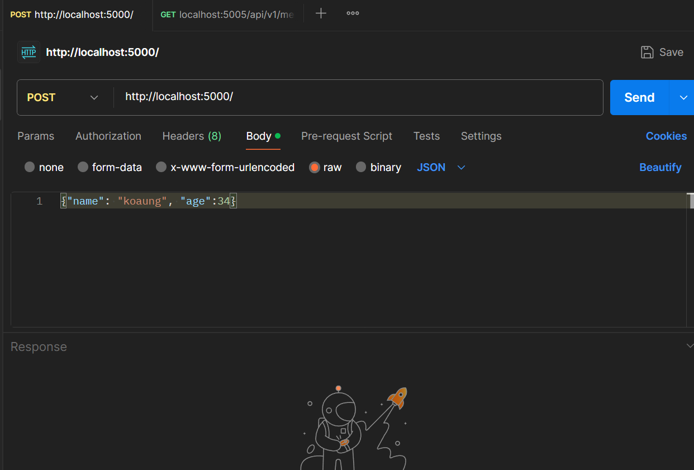
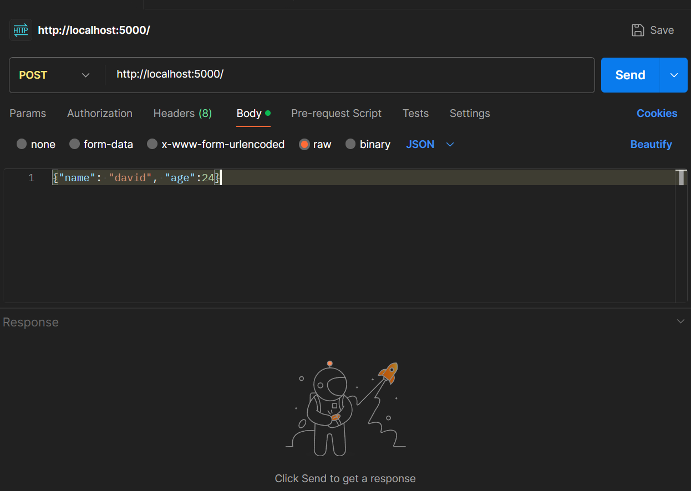
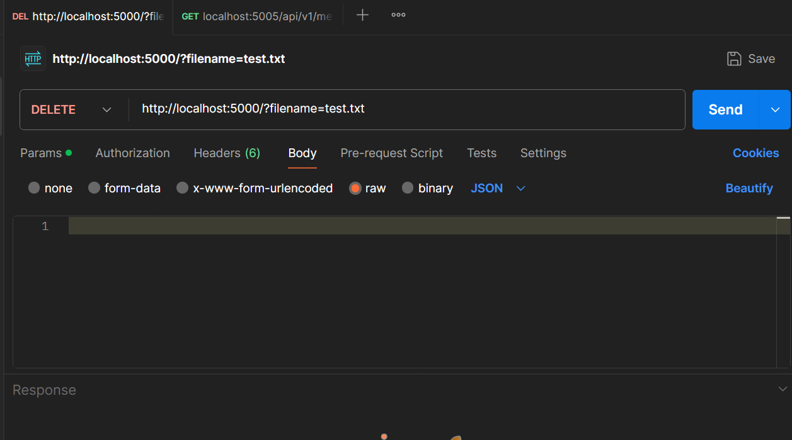

### Express

- Express ဆိုတာ nodeကို ပိုမိုလွယ်ကူစွာ အသုံးပြုနိုင်အောင် ပြုလုပ်ပေးတဲ့ အရာတစ်ခုဖြစ်ပါတယ်။
- express မှာ **middleware** တွေ အသုံးပြုပြီး request တွေ response တွေကို စီမံခန့်ခွဲလို့ရပါတယ်။

##

### express middleware

- middleware ဆိုတာ function တစ်မျိုး ဖြစ်ပါတယ်။
- express မှာ middleware ( ၅ ) မျိုး ရှိပါတယ်။
- [Application-level middleware](https://expressjs.com/en/guide/using-middleware.html#middleware.application)
- [Router-level middleware](https://expressjs.com/en/guide/using-middleware.html#middleware.router)
- [Error-handling middleware](https://expressjs.com/en/guide/using-middleware.html#middleware.error-handling)
- [Built-in middleware](https://expressjs.com/en/guide/using-middleware.html#middleware.built-in)
- [Third-party middleware](https://expressjs.com/en/guide/using-middleware.html#middleware.third-party)

### Syntex

```js
express().middleware(route, callback);

//example
import express from "express";
const app = express();

app.get("/", (req, res) => {
  res.send("Hello World!");
});
```

##

### Create Express server

```js
import express from "express";
const app = express();
const port = 5000;

app.get("/", (req, res) => {
  res.send("Hello World!");
});

app.listen(port, () => {
  console.log(`Example app listening on port ${port}!`);
});
```

- express ကို လှမ်းယူထားပြီး app ကို express() အဖြစ် သတ်မှတ်ကာ server create လုပ်ပြီး port 5000 မှာ listen ထားပါတယ်။
- အထဲမှာ get middleware ကို အသုံးပြုပြီး root route နဲ့ request လုပ်လာရင် Hello World! ကို response လုပ်ထားတာဖြစ်ပါတယ်။
- `npm run dev` ကို အသုံးပြုပြီး server ကို start လုပ်လိုက်တဲ့အခါ Hello World! ကို localhost:3000 မှာ ပြပေးနေမှာပါ။
- အထက်ပါအတိုင်းပဲ post , put , delete middleware တွေကို စမ်းသပ်ရေးသားကြည့်ပါ။

##

### use( ) middleware

-အသုံးပြုလိုတဲ့ middleware ကို ခေါ်သုံးချင်တဲ့အခါ အသုံးပြုပါတယ်

##

```js
app.use((req, res, next) => {
  console.log("Request received");
  next();
});
```

- request တစ်ခု၀င်လာတိုင်း "Request received" ကို log ထုတ်ခိုင်းလိုက်တာဖြစ်ပါတယ်
- browser ကနေ request တစ်ခုလုပ်တိုင်း terminal မှာ "Request received" ဆိုပြီး log ထုတ်ပေးနေတာ မြင်ရမှာဖြစ်ပါတယ်။

##

##

## Send request with Postman

- အရင်ဆုံး Postman ကို https://www.postman.com/downloads/ ကနေ download လုပ်ပြီး install လုပ်ပေးပါ။
- create account လုပ်မလားမေးရင် ဘေးနားက skip ... ကို နှိပ်လိုက်ပါ
- overwrite ဘေးက + ကို နှိပ်ပြီး postman ကို စသုံးလို့ရပါပြီး။


- method ဆိုတာက ကျနော်တို့ server ကို request လုပ်တဲ့ အခါ သုံးရမယ့် http method တွေကို ဆိုလိုတာပါ။
- url/route မှာတော့ မိမိတို့ရဲ့ node server adress နဲ့ port ကို ရေးပေးရမှာပါ။
- ( ဥပမာ **localhost:3000** )
- send ခလုတ်ကတော့ server ဆီ request လှမ်းပို့လိုက်တာပါ။
- output မှာတော့ server ကနေ response ပြန်တဲ့ဟာကို ပြပေးမှာ ဖြစ်ပါတယ်

##

### read file and send data (using fs)

- node js မှာ fs.readFIleSyncကို file တွေဖတ်နိုင်ဖို့သုံးခဲ့ကြပါတယ်
- file တွေ ရေးနိုင်ဖို့ fs.writeFileSyncကို အသုံးပြုနိုင်ပါတယ်

## Syntax

`fs.writeFileSync("file-name", data)`

### Usage

`fs.writeFileSync("hello.txt", "hello world")`

- writeFileSync က ပထမ parameter မှာ ထည့်ပေးလိုက်တဲ့ file name အတိုင်း file တစ်ခု create လုပ်ပေးလိုက်မှာဖြစ်ပြီး ဒုတိယ parameter မှာ ထည့်ပေးလိုက်တဲ့ data ကို create လုပ်တဲ့ ဖိုင်ထဲမှာ ထည့်ပေးလိုက်မှာဖြစ်ပါတယ်
- `fs.writeFileSync("hello.txt", "hello world")`
- အပေါ်က ကုဒ်ကို run လိုက်မယ်ဆိုရင် အထဲမှာ hello world ဆိုတဲ့ text တစ်ခုပါတဲ့ hello.txt ဖိုင်တစ်ခု လုပ်ပေးလိုက်မှာဖြစ်ပါတယ်
- အကယ်လို့ ပထမ parameter မှာ ထည့်ပေးလိုက်တဲ့ file name အတိုင်း file တစ်ခုရှိပြီးသားဆိုရင်တော့ အထဲက data မှာ ဒုတိယ parameter မှာ ထည့်ပေးလိုက်တဲ့ data ကို **replace** လုပ်ပေးလိုက်မှာပဲဖြစ်ပါတယ်

```js
app.post("/", (req: Request, res: Response) => {
  const data = req.body;
  fs.writeFileSync("data.json", data);
  res.send("file added");
});
```

- post middle နဲ့ post method ကို လက်ခံထားပါတယ်
- request နဲ့ အတူပါလာမယ့် data ကို req.body နဲ့ လက်ခံထားလိုက်ပါတယ်
- fs.writeFileSync ကို သုံးပြီး ၀င်လာတဲ့ data နဲ့ data.json file တစ်ခု create လုပ်ပေးမှာဖြစ်ပါတယ်

## request လုပ်လိုက်ရင် ထည့်ပေးလိုက်တဲ့ data က

- text(string) ဖြစ်တယ်ဆိုရင် express server မှာ လက်ခံနိုင်ဖို့ `express.text()` ကို သုံးပေးရပါမယ်
- json sting ဖြစ်တယ်ဆိုရင် express server မှာ လက်ခံနိုင်ဖို့ `express.json()` ကို သုံးပေးရပါမယ်

```js
import express from "express";
import fs from "fs";

const app = express();
const port = 5000;

//for text(string)
app.use(express.text());

// for json
app.use(express.json());

app.get("/", (req, res) => {
  res.send("Hello World!");
});

app.post("/", (req: Request, res: Response) => {
  const data = req.body;
  fs.writeFileSync("data.json", data);
  res.send("file added");
});
app.listen(port, () => {
  console.log(`Example app listening on port ${port}!`);
});
```

## Sent POST request with text data



- postman ကနေ ပုံပါတိုင်းrequest send လိုက်ရင်တော့ wlecome ဆိုတဲ့ text ပါတဲ့ data.json ဖိုင်တစ်ခု create လုပ်ပေးတာကို မြင်ရမှာဖြစ်ပါတယ်

## Sent POST request with json data



- postman ကနေ ပုံပါတိုင်းrequest send လိုက်ရင်တော့ data.json ဖိုင်ထဲက wlecome ဆိုတဲ့ text နေရာမှာ{name: "koaung", age:34} ကို အစားထိုးပေးတာလိုက်ကို မြင်ရမှာဖြစ်ပါတယ်
- အရင်ရှိပြီးသားdata တွေ မပျက်ချင်ပဲ request က data တွေကို data.json မှာ ထပ်ထည့်ချင်ရင်တော့ ခုလိုလုပ်ပေးရမှာဖြစ်ပါတယ်
- အရင်ဆုံး data.json မှာရှိတဲ့ data ကို array အဖြစ် ပြောင်းလိုက်ပါမယ်

```js
// data.json

[{ name: "koaung", age: 34 }];
```

- post middleware မှာ ခုလိုပြင်ပေးလိုက်ပါမယ်

```js
// at post middleware

app.post("/", (req: Request, res: Response) => {
  const data = req.body;
  const existingData = fs.readFileSync("data.json").toString();
  const existArray = JSON.parse(existingData);
  const newArray = [...existArray, data];
  const newFile = fs.writeFileSync("data.json", JSON.stringify(newArray)); //Buffer,string,unit8arry
  res.send("file updated");
});
```

- data.json ထဲရှိပြီးသား dataတွေကို readFileSync နဲ့ အရင်ဖတ်လိုက်ပြီး ၀င်လာတဲ့ dataကို array တစ်ခုထဲမှာ အတူတူ ထည့်ပေးလိုက်ပြီး new array အဖြစ်သိမ်းလိုက်ပါတယ်
- writeFileSync မှာ newArray ကို json string ပြောင်းပြီး data parameter အဖြစ်ထည့်ပေးလိုက်တာပဲဖြစ်ပါတယ်
  
- postmanနဲ့ နောက်ထပ် json တစ်ခု ထပ်ပြီးrequest လုပ်ကြည့်ပါက data.jsonမှာ ခုလို ရလာမှာဖြစ်ပါတယ်

```js
//data.json

[
  { name: "koaung", age: 34 },
  { name: "david", age: 24 },
];
```

## Url structure

## syntax

`url-address : port / route / params ? query
`

- **`:`** ရှေ့က အရာတွေကို url-address လို့ သတ်မှတ်ပြီး
- **`:`** နောက်က port ဖြစ်ပါတယ်
- port နောက်က / ကနေ params မရောက်ခင်အထိကို route လို့ သတ်မှတ်ပါတယ်
- `/2` `/34` လို / နောက်မှာ number နဲ့ လာတယ်ဆိုရင် params လို့ သတ်မှတ်ပါတယ်
- ? နောက်မှာ ရှိတဲ့ အရာတွေကို တော့ query လို့ သတ်မှတ်ပါတယ်
- query ကို key=value ဆိုပြီး တွဲရေးပေးရပါတယ်
- query တစ်ခုထပ်ပိုထည့်ချင်ရင် `&` နဲ့ဆက်ပြီး ရေးပေးရပါမယ် `?name=aung&age=34`

```


//example 1
http://localhost:5000/menus/2
url-address = http://localhost
port= 5000
route = /menus
params = "2"

//example 2
http://localhost:5000/users?name=ko aung
url-address = http://localhost
port= 5000
route = /users
query = name=ko aung ( {name:"Ko aung"} )
```

> url မှာရှိတဲ့ တန်ဖိုးတွေကို ရယူတဲ့အခါ string အဖြစ်ပဲ လက်ခံရရှိမှာဖြစ်ပါတယ်

##

## delete file with `fs.unlink()`

## Syntax

`fs.unlink("path/file-name",callback)`

## Usage

```js
fs.unlink("test.txt", (error) => {
  if (error) throw error;
  console.log("file deleted");
});
```

- အရင်ဆုံး project folder ထဲမှာ test.txt ဖိုင်တစ်ခု လုပ်ထားလိုက်ပါ
- ဖိုင် delete လုပ်မှာမို့လို့ delete middleware ကို အသုံးပြုပါမယ်

```js
app.delete("/", (req: Request, res: Response) => {

  const { filename } = req.query;
  console.log(filename);

  fs.unlink(filename as string, (error) => {
    if (error) throw error;
    console.log("file deleted");
  });
  res.send("file deleted");
});
```



- postmanနဲ့ delete request လုပ်လိုက်ပြီး query အနေနဲ့ ဖျက်ချင်တဲ့ filename ကို ပါ ထည့်ပေးလိုက်ပါတယ်
- delete middleware မှာ req.query ဆိုပြီး query ကို လက်ခံလိုက်ပြီး ရလာတဲ့ data ထဲက filename ရဲ့ တန်ဖိုးကို ယူလိုက်ပါတယ်
- query က objcet အဖြစ် လက်ခံရရှိမှာဖြစ်ပြီး နမူနာအရ `{filename: "test.txt "}` ရလာတဲ့အထဲက filename ရဲ့ တန်ဖိုးကို destructure လုပ်ပြီး ထုတ်ယူလိုက်တာပဲဖြစ်ပါတယ်
