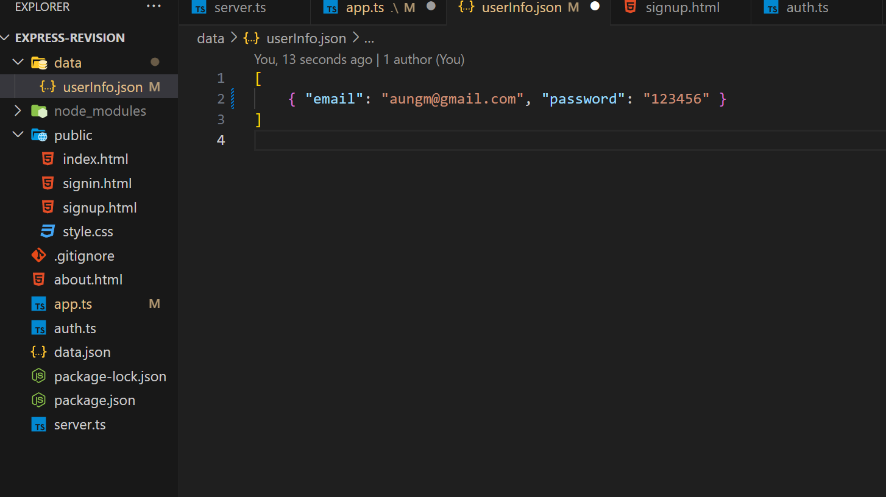
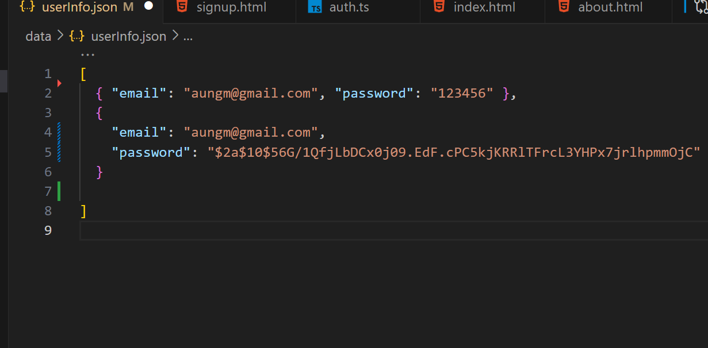

### read static file and send data

- node http server မှာလို route တွေ check/ ဖိုင် တွေ ဖတ် / ရလာတဲ့ data တွေ response ပြန်လုပ် စတာတွေ မလိုတော့ပဲ express မှာ static middleware ကို အသုံးပြူနိုင်ပါတယ်။

### syntax

### `app.use(express.static("folder-name"))`

- အရင် ဆုံး project folder ထဲမှာ public ဆိုတဲ့ folder တစ်ခု ဆောက်ပါ
- public folder ထဲမှာ index.html ဖိုင်တစ်ခုလုပ်ပြီး head tag တစ်ခု ရေးပေးထားပါ။
- index.js ရှိ express server မှာ static middleware ကို အသုံးပြုပါမယ်

```js
import express from "express";
const app = express();
const PORT = 5000;

app.use(express.static("public"));

app.listen(PORT, () => console.log("server is running on port", PORT));
```

- localhost:5000 ကို ၀င်လိုက်တာနဲ့ index.html ကို ဖတ်ပြီး ရေးထားတဲ့ head tag ကို ပြပေးနေမှာဖြစ်ပါတယ်။

##

## send request with html form tag

- html form တစ်ခုကို သုံးပြီ;server ဆီကို request ပို့တာ လုပ်ကြည့်ကြပါမယ်
- အရင်ဆုံး public folder အောက်မှာ signup.html file တစ်ခုလုပ်ပါမယ်

```html
<!DOCTYPE html>
<html lang="en">
  <head>
    <meta charset="UTF-8" />
    <meta name="viewport" content="width=device-width, initial-scale=1.0" />
    <link rel="stylesheet" href="style.css" />
    <title>Document</title>
  </head>
  <body>
    <h1>Sign up</h1>

    <form action="/signup" method="post">
      <input type="text" name="email" placeholder="your email" />
      <input type="text" name="password" placeholder="your password" />

      <input type="submit" value="Send" />
    </form>
  </body>
</html>
```

- form tag ကို သုံးထားပြီး action attribute မှာ request လုပ်ချင်တဲ့route ကို ထည့်ပေးရပါမယ်
- method မှာတော့ သုံးမယ့် http method ကို ထည့်ပေးထားပါတယ်
- input tag နှစ်ခုကို form ထဲမှာထည့်ထားပြီး emial နဲ့ password ဆိုပြီး name တွေ ပေးထားလိုက်ပါတယ်
- အောက်မှာ type submit ပေးထားတဲ့ inputတစ်ခု လုပ်ထားလိုက်ပါတယ်
- http://localhost:5000/signup.html ကို သွားပြီး email နဲ့ password ကို ဖြည့်ပြီး send လုပ်ကြည့်ပါက "/signup" route ကို post method နဲ့ request လုပ်ပေးမှာဖြစ်ပြီး data payload အနေနဲ့ ဖြည့်ထားတဲ့ email နဲ့ password ကို တစ်ခါတည်းထည့်ပေးလိုက်တာကို မြင်ရမှာဖြစ်ပါတယ်


- post request နဲ့ အတူပါလာတဲ့ form data ကို လက်ခံဖို့ express server မှာ body-parser ဆိုတဲ့ npm package တစ်ခုကို Install လုပ်ပေးရပါမယ်

```properties
$ npm i body-parser
$ npm i -D @types/body-parser
```

- project folder ထဲမှာ data folder တစ်ခု လုပ်ပေးထားပါ
- express server မှာ post request ကို လက်ခံလိုက်ပါမယ်

```js
import bodyParser from "body-parser";
import express from "express";
import fs from "fs";

const app = express();
const PORT = 5000;

//express.static
// syntax -> express.static("public") --> index.html
//text -> express.text
//json -> express.json
//form data -> bodyParser.urlencoded

app.use(express.static("public"));
app.use(bodyParser.urlencoded({ extended: true }));

app.post("/signup", (req, res) => {
  const { email, password } = req.body;

  const newUser = { email, password };

  const existingData = fs.readFileSync("./data/userInfo.json", "utf-8");
  const existingArry = JSON.parse(existingData);
  const newData = [...existingArry, newUser];

  fs.writeFileSync("./data/userInfo.json", JSON.stringify(newData));

  res.send("user registered");

  app.listen(PORT, () => console.log("serve is runing on port", PORT));
});
```

- form data ကို လက်ခံလို့ရအောင် use middleware နဲ့ bady-parser ကို အသုံးပြုထားပါတယ်
- ရလာတဲ့ dataကို data folder ထဲမှာ userInfo.json အဖြစ် သွားသိမ်းလိုက်တာပဲဖြစ်ပါတယ်
  

- userInfo.json မှာ password ကို သာမန် string အနေနဲ့ ပဲ သွားသိမ်းပေးတာကို မြင်ရမှာဖြစ်ပါတယ်
- real world project တွေမှာ password တွေကို သာမန် string အနေနဲ့ ပဲသိမ်းလေ့မရှိပဲ hash လုပ်ပြီး password ကို ရောသမမွှေပြီးမှ အလွယ်ခန့်မှန်းလို့မရအောင် သိမ်းလေ့ရှိပါတယ်
- သာမန် string တစ်ခုကို hash လုပ်နိုင်ဖို့ bcryptjs ဆိုတဲ့ package ကို အသုံးများပါတယ်

```bash
$ npm i bcryptjs
$ npm i -D @types/bcryptjs
```

- userInfo ကိုသွားသိမ်းတဲ့နေရာမှာ password ကို သာမန် string အနေနဲ့ မသိမ်းတော့ပဲ hash လုပ်ပြီး သိမ်းလိုက်ပါမယ်

```js
app.post("/signup", (req, res) => {
  const { email, password } = req.body;

  const salt = bcrypt.genSaltSync(10);
  const hashedPassword = bcrypt.hashSync(password, salt);

  const newUser = { email, password: hashedPassword };

  const existingData = fs.readFileSync("./data/userInfo.json", "utf-8");
  const existingArry = JSON.parse(existingData);
  const newData = [...existingArry, newUser];
  fs.writeFileSync("./data/userInfo.json", JSON.stringify(newData));
  res.send("user registered");
});
```

- bycript ကို import လုပ်ပေးလိုက်ပါ
- bycript က genSaltSync(10)ကို သုံးပြီး ရောသမမွှေ မယ့် function ( salt )ကို လုပ်လိုက်ပါတယ်
- bcrypt.hashSync(password, salt) နဲ ့ password ကို salt function နဲ့ ရောလိုက်ပီး hash လုပ်လိုက်တာပဲဖြစ်ပါတယ်
- hash လုပ်ပြီးသားasswordကိုမှ newUser ရဲ့ password အနေနဲ့ သိမ်းလိုက်တာပဲဖြစ်ပါတယ်
- ခုနက email နဲ့ password ကိုပဲ signup လုပ်ကြည့်လိုက်ပါက အခုလို hasd password နဲ့ သိမ်းလိုက်မှာဖြစ်ပါတယ်
- 

#

## signin

- နောက်ထပ် signin.html ဖိုင်တစ်ခုလုပ်လိုက်ပါမယ်

```html
<!DOCTYPE html>
<html lang="en">
  <head>
    <meta charset="UTF-8" />
    <meta name="viewport" content="width=device-width, initial-scale=1.0" />
    <link rel="stylesheet" href="style.css" />
    <title>Document</title>
  </head>
  <body>
    <h1>Sign In</h1>

    <form action="/signin" method="post">
      <input type="email" name="email" placeholder="your email" required />
      <input type="text" name="password" placeholder="your password" required />

      <input type="submit" value="Send" />
    </form>
  </body>
</html>
```

- email နဲ့ password ဖြည့်ပြီး send လုပ်လိုက်တဲ့အခါ singup လုပ်တုန်းက သိမ်းထားတဲ့ userInfo.json ထဲမှာ email နဲ့ သွားရှာလိုက်မှာဖြစ်ပြီး password တူမတူ တိုက်စစ်လိုက်မှာဖြစ်ပါတယ်

```js
app.post("/signin", (req, res) => {
  const { email, password } = req.body;
  const isValid = email && password;

  //validation
  if (!isValid) {
    return res.status(400).send(" information required");
  }

  //get existing
  const existingData = fs.readFileSync("./data/userInfo.json", "utf-8");
  const existingArry: { email: string, password: string }[] =
    JSON.parse(existingData);

  //find user
  const foundedUser = existingArry.find((user) => user.email === email);
  if (!foundedUser) {
    return res.send("no user found");
  }
  const oldPassword = foundedUser.password;

  const isSamePassword = bcrypt.compareSync(password, oldPassword);

  if (!isSamePassword) {
    return res.status(401).send("Credential invalid");
  }
  res.redirect("/");
});
```

- request နဲ့ ပါလာတဲ့ email နဲ့ password ကို ရှိမရှိ စစ်ထားပါတယ်
- အဲ့တာကို validation လုပ်တယ်လို့ ခေါ်ပါတယ်
- လိုအပ်တဲ့အချက်တွေ ပါမပါကို စစ်တာဖြစ်ပါတယ်
- userInfo.json မှာ request နဲ့ ပါလာတဲ့ email နဲ့ user ရှိခဲ့ရင် သိမ်းထားတဲ့ hash password ကို old password အဖြစ်ယူလိုက်ပြီး request နဲ့ ပါလာတဲ့ password နဲ့ တူမတူ ကို bcrypt.compareSync ကို သုံးပြီး စစ်လိုက်ပါတယ်
- မတူခဲ့ရင်တော့ password မှားနေကြောင်း 401 unauthorize နဲ့ responase ပြန်ပေးလိုက်ပါတယ်
- တူခဲ့ရင်တော့ res.redirect ကို သုံးပြီး home page (root route )ကို ပို့ပေးလိုက်တာပဲဖြစ်ပါတယ်

##

### Valid ဖြစ်တဲ့ user ဖြစ်ခဲ့ရင် server ဘက်ကနေ token တစ်ခုကို ထုတ်ပေးလိုက်ကာ အဲ့ဒီ token ရှိနေသရွေ့ user က signin ထပ်လုပ်စရာမလိုတော့ပဲ website ကို အသုံးပြုလို့ရအောင် လုပ်ပေးပါမယ်

- jsonwebtoken ဆိုတဲ့ package ကိုသုံးပြီး web tokenတစ်ခုကို signin route (post request)ကို လက်ခံတဲ့နေရာမှာ လုပ်လိုက်ပါမယ်

```console
$ npm i jsonwebtoken
$ npm i -D @types/jsonwebtoken
```

```js
//server.ts --> app.post('/signin')

app.post("/signin", (req, res) => {
  const { email, password } = req.body;
  const isValid = email && password;

  //validation
  if (!isValid) {
    return res.status(400).send(" information required");
  }

  //get existing
  const existingData = fs.readFileSync("./data/userInfo.json", "utf-8");
  const existingArry: { email: string, password: string }[] =
    JSON.parse(existingData);

  //find user
  const foundedUser = existingArry.find((user) => user.email === email);
  if (!foundedUser) {
    return res.send("no user found");
  }
  const oldPassword = foundedUser.password;

  const isSamePassword = bcrypt.compareSync(password, oldPassword);

  //jwt.sign('str/obj/Buffer' , secretOrPrivateKey ,options)
  const token = jwt.sign(
    { email: foundedUser.email },
    "EyCXS3524524UHhVL5Xykaadn0QVix",
    { expiresIn: "1h" }
  );
  console.log(token);

  // res.cookie("key", value)
  res.cookie("token", token);

  if (!isSamePassword) {
    return res.status(401).send("Credential invalid");
  }
  res.redirect("/");
});
```

- ခုနက user valid and password check လုပ်ထားပြီး response နဲ့ redirect မလုပ်ခင်လေးမှာ jwt.sign နဲ့ tooken တစ်ခုကို crate လုပ်လိုက်ပါတယ်
- jwt.sign မှာ
  - ပထမ parameter အဖြစ် sign လုပ်ချင်တဲ့ email ကို ထည့်ပေးရမှာဖြစ်ပြီး
  - ဒုတိယ parameter အဖြစ် secretKey ကို ထည့်ပေးရပါမယ်
  - secretKey ကို အလွယ်တကူခန့်မှန်းလို့မရနိုင်တဲ့ ramdom string တစ်ခုခု ပေးထားပါတယ်
  - တတိယ parameter အဖြစ် option object ကိုထည့်ပေးရမှာဖြစ်ပြီး expire option ကို ထည့်ပေးထားပါတယ်
  - expiresIn: "1h" က token ကို တစ်နာရီအတွင်းပဲ အသုံးပြုလို့ရမယ်လို့ ဆိုလိုတာဖြစ်ပါတယ်
- jwt နဲ့ လုပ်ထားတဲ့ token ကို res.cookie("token", token) ဆိုပြီး browser cookie မှာ သွားသိမ်းပေးလိုက်ပါတယ်

- ခု `http://localhost:5000/signin.html` ကို သွားပြီး signup လုပ်ထားတဲ့ user eamil / password ကို မှန်အောင်ထည့်ပေးကြည့်ပါက browser cokkies မှာ token တစ်ခု ရောက်လာတာကို မြင်ရမှာဖြစ်ပါတယ်
  

##

- express မှာ middleware တွေကို အသုံးပြုတဲ့အခါ callback function တွေမှာ req.res သာမကပဲ next ဆိုတဲ့ parameter တစ်ခုကိုလဲလက်ခံပြီး သုံးလို့ရပါတယ်

```js
//example
const newMiddleWare = (req,res,next)=>{
 console.log("hello")
 next()
})

// app.get("route",newMiddleWare,next-function)

app.get("/",newMiddleWare,(req,res)=>{
  res.send("hello")
})


```

- အထက်ပါ example မှာ newMiddleWare တစ်ခုကို သတ်မှတ်လိုက်ပြီး next parameter ကိုပါ လက်ခံထားပါတယ်
- callback အထဲမှာတော့ log တစ်ခုပဲ ထုတ်ထားပြီး next ကို ေခါ်ပေးထားလိုက်ပါတယ်
- get method နဲ့ request ၀င်လာရင် လက်ခံတဲ့ အခါ route နဲ့ callback ကြားမှာ newMiddleWare ကို ထည့်သုံးထားပါတယ်
- get method နဲ့ request ၀င်လာရင် res.send("hello") လုပ်ထားတဲ့ callback ကို တစ်ခါတည်းသွားမှာ မဟုတ်ပဲ newMiddleWare ကို အရင် run ပေးမှာဖြစ်ပါတယ်
- newMiddleWare မှာ next function ကို ေခါ်ထားမှသာ သူ့နောက်က res.send("hello") လုပ်ထားတဲ့ callback fnuction က run ပေးမှာဖြစ်ပါတယ်
-

## authorization

- about page တစ်ခု လုပ်လိုက်ပါမယ်
  
- `http://localhost:5000/about.html` ကို user တစ်ယောက်၀င်လာတဲ့အခါ newMiddleWare နဲ့ token ရှိမရှိ/မှန်မမှန် စစ်လိုက်ပြီး token valid ဖြစ်မှသာ next function ကို ခေါ်ပေးလိုက်မှာဖြစ်ပြီး about page ကို သွားခိုင်းလိုက်မှာဖြစ်ပါတယ်
- cookie ထဲက token ကို ယူနိုင်ဖို့ cookie-parser package ကို အသုံးပြုရပါမယ်

```console
$ npm i cookie-parser
$ npm i -D @types/cookie-parser
```

```js
import bodyParser from "body-parser";
import express, { NextFunction, Request, Response } from "express";
import fs from "fs";
import bcrypt from "bcryptjs";
import jwt from "jsonwebtoken";
import cookieParse from "cookie-parser";
const app = express();
const PORT = 5000;

app.use(express.static("public"));
app.use(bodyParser.urlencoded({ extended: true }));
app.use(cookieParse());

app.post("/signup", (req, res) => {
  ............
  ..............
  ...........
});

app.post("/signin", (req, res) => {
 ..............
 ................
 ...........
});

const newMiddleWare = (req: Request, res: Response, next: NextFunction) => {
  const token = req.cookies.token;

  if (!token) {
    return res.status(401).redirect("/signin.html");
  }

  jwt.verify(token, "EyCXS3524524UHhVL5Xykaadn0QVix", (err) => {
    if (err) {
      return res.status(401).send("Unauthorized");
    }

    next();
  });
};

app.get("/about.html", newMiddleWare, (req, res) => {
  res.send("hello");
});


app.listen(PORT, () => console.log("serve is runing on port", PORT));

```

- token ကို req.cookies ကနေ ယူလိုက်ပါတယ်
- token မရှိခဲ့ရင်တော့ signin page ကို redirect လုပ်လိုက်ပြီး login ၀င်ခိုင်းမှာဖြစ်ပါတယ်
- token ရလာရင်တော့ jwt.verify နဲ့ valid ဖြစ်မဖြစ် စစ်လိုက်ပြီး valid ဖြစ်မှသာ next function ကို ခေါ်ပေးမှာဖြစ်ပါတယ်

##

## Logout/Signout

- index.html မှာ logout form တစ်ခုထည့်လိုက်ပါမယ်

```html
<!DOCTYPE html>
<html lang="en">
  <head>
    <meta charset="UTF-8" />
    <meta name="viewport" content="width=device-width, initial-scale=1.0" />
    <link rel="stylesheet" href="style.css" />
    <title>Document</title>
  </head>
  <body>
    <h1>Home page</h1>

    <h1>Welcome User</h1>
    <form action="/logout" method="POST">
      <input type="submit" value="Log Out" />
    </form>
  </body>
</html>
```

- post method နဲ့ '/logout ' route ကို request လုပ်လိုက်တာပဲဖြစ်ပါတယ်

```js
import bodyParser from "body-parser";
import express, { NextFunction, Request, Response } from "express";
import fs from "fs";
import bcrypt from "bcryptjs";
import jwt from "jsonwebtoken";
import cookieParse from "cookie-parser";
const app = express();
const PORT = 5000;

app.use(express.static("public"));
app.use(bodyParser.urlencoded({ extended: true }));
app.use(cookieParse());

app.post("/signup", (req, res) => {
  ............
  ..............
  ...........
});

app.post("/signin", (req, res) => {
 ..............
 ................
 ...........
});

const newMiddleWare = (req: Request, res: Response, next: NextFunction) => {
  const token = req.cookies.token;

  if (!token) {
    return res.status(401).redirect("/signin.html");
  }

  jwt.verify(token, "EyCXS3524524UHhVL5Xykaadn0QVix", (err) => {
    if (err) {
      return res.status(401).send("Unauthorized");
    }

    next();
  });
};

app.get("/about.html", newMiddleWare, (req, res) => {
  res.send("hello");
});

app.post("/logout", (req, res) => {
  res.clearCookie("token");
  res.redirect("/signin.html");
});

app.listen(PORT, () => console.log("serve is runing on port", PORT));

```

- /logout post request ကို လက်ခံလိုက်ပြီး cookie ထဲက token ကို clear လုပ်လိုက်ပီး signin page ကို redirect လုပ်ပေးလိုက်တာပဲဖြစ်ပါတယ်
