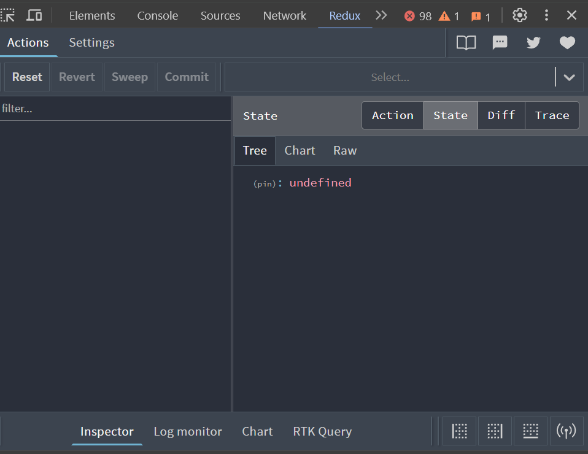

## Redux toolkit

### What is redux ?

- redux ဆိုတာ reactJS မှာ state တွေ management လုပ်တဲ့အခါ ပိုမိုလွယ်ကူစေရန်သုံးတဲ့ package တစ်ခု ဖြစ်ပါတယ်
- app တွေ က complex ဖြစ်လာတဲ့အခါ context နဲ့ state management လုပ်ရတာ ရှုပ်ထွေးလာပြီး အဆင်မပြေ ဖြစ်လာတက်ပါတယ်
- အဲ့ဒီအခါကျရင် redux ကို သုံးပြီး management လုပ်ရင် အဆင်ပြေပြေ နဲ့ အလုပ်လုပ်နိုင်မှာဖြစ်ပါတယ်

### Redux data flow ( one way data flow)


- redux မှာ state တွေကို store ထဲမှာ reducer ထဲ slice တွေ အနေနဲ့ သိမ်းထားလေ့ရှိပါတယ်
- state တွေကို update လုပ်တဲ့အခါ store ထဲကို တစ်ခါတည်း update လုပ်ပေးမှာမဟုတ်ပဲ
  သက်ဆိုင်ရာ action ( slice ထဲမှာ သတ်မှတ်ထားသော action) ကို အရင် ဆက်သွယ်လိုက်( dispatch) ပါတယ်
- အဲ့ဒီ action တွေမှတစ်ဆင့် reducer တွေနဲ့ ချိတ်ဆက်ပြီး store ထဲက သက်ဆိုင်ရာ state ကို update လုပ်ပေးကာ ရလာတဲ့ result ကို subscribe လုပ်ထားတဲ့ UI ဆီမှာ ပြန်ပို့ပေးတာဖြစ်ပါတယ်


##

### Redux tookit

- redux toolkit ကတော့ အထက်ပါ ရှင်းပြထားတဲ့ redux ကို ပိုမိုလွယ်ကူအောင် လုပ်ထားပေးတဲ့ package တစ်ခုပဲ ဖြစ်ပါတယ်

### Store

- **_Store_** ဆိုတာ data တွေ ကို သိမ်းထားတဲ့နေရာလို မှတ်ယူနိုင်ပါတယ်
  - store ထဲမှာ state တွေကို reducer ထဲမှာ သက်ဆိုင်ရာ အကန့်တွေ နဲ့ ( slice ) လုပ်ပြီး reducer အဖြစ် သိမ်းထားလေ့ရှိပါတယ်
  - ဥပမာ ။ ။ menu အတွက် state တွေကို menuSlice ဆိုတဲ့ slice တစ်ခုလုပ်ပြီး သိမ်းထားတာမျိုးပါ
  - addon အတွက် ဆိုလဲ addonSlice တစ်ခု သပ်သပ် ထပ်လုပ်ပြီး သိမ်းထားမယ်ပေါ့
  - အဲ့ဒီ slice တွေ ထဲမှာမှ action တွေ သတ်မှတ်ပြီး reducer ကို ချိတ်ဆက်ကာ state ကို Update လုပ်ပြီး store ထဲမှာ သိမ်းပေးမှာဖြစ်ပါတယ်
  - slice တွေ ထဲမှာမှ action တွေ သတ်မှတ်ပြီး state ကို update လုပ်ကာ store ထဲမှာ သိမ်းပေးမှာဖြစ်ပါတယ်
  - slice တစ်ခု အောက်ပါအတိုင်း create လုပ်ပေးရပါမယ်

```js
 const sliceName = createSlice({
    name,
    initialState,
    reducers : {
    actions-name :(state,payload)=>{....}
    }
  })
```

- react-redux ထဲက createSlice function ကို သုံးပြီး slice တစ်ခုကို create လုပ်လို့ရပါတယ်
- createSlice function မှာ object parameter တစ်ခု လက်ခံပါတယ်
- အဲ့ဒီ object ထဲမှာတော့
  - **name** ( slice name 0r type) slice အတွက် နာမည်
  - **initialState** မူလ အခြေအနေ
  - **reducers** ( actions ) လုပ်ဆောင်ချက်တွေ ပါတဲ့ object
- စတာတွေ ပါပါတယ်
- action တွေ မှာလည်း parameter နှစ်ခု လက်ခံပါတယ်
- ပထမ parameter က state ထဲက vlaue တွေ ဖြစ်ပြီး ဒုတိယ parameter က action တွေကို dispatch လုပ်တဲ့အခါ ၀င်လာမယ့် data ( payload ) တွေ ဖြစ်ပါတယ်

## Setup redux toolkit in project

- project မှာ redux toolkit ကို အသုံးပြုနိုင်ဖို့ react-redux နဲ့ reduxjs/toolkit ကို ထည့်ပေးရပါမယ်

```console
npm i react-redux @reduxjs/toolkit
```

- redux toolkit ကို စသုံးနိုင်ရန် store တစ်ခုကို create လုပ်ပေးရပါမယ်
- src အောက်မှာ store folder တစ်ခု လုပ်ပြီး index.ts ဖိုင်တစ်ခုလုပ်ပါမယ်

```js
import { configureStore } from "@reduxjs/toolkit";

// ...

export const store = configureStore({
  reducer: {},
});

// Infer the `RootState` and `AppDispatch` types from the store itself
export type RootState = ReturnType<typeof store.getState>;
// Inferred type: {posts: PostsState, comments: CommentsState, users: UsersState}
export type AppDispatch = typeof store.dispatch;
```

- @reduxjs/toolkit ထဲက configureStore ကို အသုံးပြုပြီး store တစ်ခု လုပ်လိုက်ပါတယ်
- configureStore function မှာ parameter အနေနဲ့ object တစ်ခု လက်ခံပြီး အဲ့ဒီ object ထဲမှာ reducer ဆိုတဲ့ property နဲ့ slice တွေကို ထည့်ပေးရမှာဖြစ်ပါတယ်
- အောက်ဆုံးမှာေတာ့ RootState နဲ့ AppDispatch ဆိုတဲ့ type နှစ်ခုကို export လုပ်ထားပါတယ်
- redux store တစ်ခု ကို အတက်ပါအတိုင်း တည်ဆောက်ပေးရမှာဖြစ်ပါတယ်
-

### ခု redux toolkit ကို သုံးပြီး counter slice တစ်ခု လုပ်ကြည့်ပါမယ်

- counter app အတွက် counter slice တစ်ခု လုပ်ပါမယ်
- store folder အောက်မှာ slice တွေ ထားမယ့် slices folder တစ်ခု လုပ်ပြီး အဲ့ဒီထဲမှာ counterSlice.ts ဖိုင်တစ်ခု လုပ်ပါမယ်

```js
//src / store / slices / counterSlice.ts

import { createSlice } from "@reduxjs/toolkit";
import { RootState } from "..";

interface CounterState {
  isLoading: boolean;
  value: number;
  data: any;
}

// Define the initial state using that type
const initialState: CounterState = {
  isLoading: false,
  value: 0,
  data: {},
};

export const counterSlice = createSlice({
  name: "counter",
  initialState,
  reducers: {
    increment: (state) => {
      state.value += 1;
    },
    decrement: (state) => {
      state.value -= 1;
    },
  },
});

export const { increment, decrement } = counterSlice.actions;

// Other code such as selectors can use the imported `RootState` type
export const selectCount = (state: RootState) => state.counter.value;

export default counterSlice.reducer;
```

- counterSlice ဆိုတဲ့ slice တစ်ခုလုပ်ထားပြီး
- name ကို counter
- initialState ကို အပေါ်မှာ သတ်မှတ်ထားတဲ့ initialState
- reducers ထဲမှာတော့ တစ်တိုး / တစ်လျော့တဲ့ action နှစ်ခုသတ်မှတ်ထားပါတယ်
- အောက်မှာတော့ action နှစ်ခုကို export လုပ်ထားပါတယ်
- ထပ်ပြီး selectCount ဆိုပြီးတော့ state ထဲက value ကို export လုပ်ထားပါတယ်
  -createSlice method ကနေ object တစ်ခု ထုတ်ပေးမှာဖြစ်ပြီး ေနာက်ဆုံးမှာတော့ counterSlice ထဲက ရလာမယ့် reducer ကို export လုပ်ထားလိုက်ပါတယ်

##

### Get and Update data from store

- store ထဲမှာ သိမ်းထားတဲ့ state က data တွေ ရယူနိုင်ဖို့ redux က useSelector hook ကို အသုံးပြုနိုင်ပါတယ်
- store ထဲမှာ သိမ်းထားတဲ့ state က data တွေကို update လုပ်နိုင်ဖို့ useDispatch hook ကို အသုံးပြုပေးရမှာဖြစ်ပါတယ်
- အထက်ပါ hook တွေကို သူ့အတိုင်း တိုက်ရိုက်သုံးလို့ရပါတယ်
- ဒါပေမယ့် လက်ရှိ project က typescript နဲ့ ရေးနေတာမလို့ အထက်ပါ hook တွေကို သူ့အတိုင်း တိုက်ရိုက်သုံးတဲ့အခါ type error တွေ တက်နိုင်တာမလို့ အထက်ပါ hook တွေကို type လုပ်ပေးထားတဲ့ custom hook တွေ လုပ်ပြီး အသုံးပြုမှာဖြစ်ပါတယ်
- store folder အောက်မှာ hooks.ts ဖိုင်တစ်ခု လုပ်ပြီး custom hook တွေ လုပ် လိုက်ပါမယ်

```js
// store / hooks.ts

import type { TypedUseSelectorHook } from "react-redux";

import { useDispatch, useSelector } from "react-redux";

import type { AppDispatch, RootState } from "./";

// Use throughout your app instead of plain `useDispatch` and `useSelector`

export const useAppDispatch: () => AppDispatch = useDispatch;

export const useAppSelector: TypedUseSelectorHook<RootState> = useSelector;
```

- useAppDispatch ဆိုတဲ့ hook တစ်ခု လုပ်ထားပါတယ်။ react-redux က useDispatch hook ကိုပဲ type လုပ်ပေးပြီး useAppDispatch hook အနေနဲ့ export လုပ်ထားတာပဲ ဖြစ်ပါတယ်
- နောက်ထပ် useAppSelector ဆိုတဲ့ hook တစ်ခု လုပ်ထားပါတယ်။ react-redux က useSelectorhook ကိုပဲ type လုပ်ပေးပြီး useAppSelector hook အနေနဲ့ export လုပ်ထားတာပဲ ဖြစ်ပါတယ်
- store ထဲက state တွေကို update လုပ် ချင်ရင် useAppDispatch ကို သုံးမှာဖြစ်ပြီး
- store ထဲက data တွေကို လို ချင်ရင် useAppSelector ကို သုံးမှာဖြစ်ပါတယ်

##

### Using redux dev tool extension(chrome and firefox)

https://chrome.google.com/webstore/detail/redux-devtools/lmhkpmbekcpmknklioeibfkpmmfibljd

- redux dev tool extension တော့ redux ရဲ့ state နဲ့ run သွားတဲ့ action တွေ ကြည့်လို့ရတဲ့ extension တစ်ခုဖြစ်ပါတယ်
- install လုပ်ပြီးသွားရင် chrome မှာ inspect လုပ်ပြီး ကြည့်လို့ရပါပြီး
- 

##
