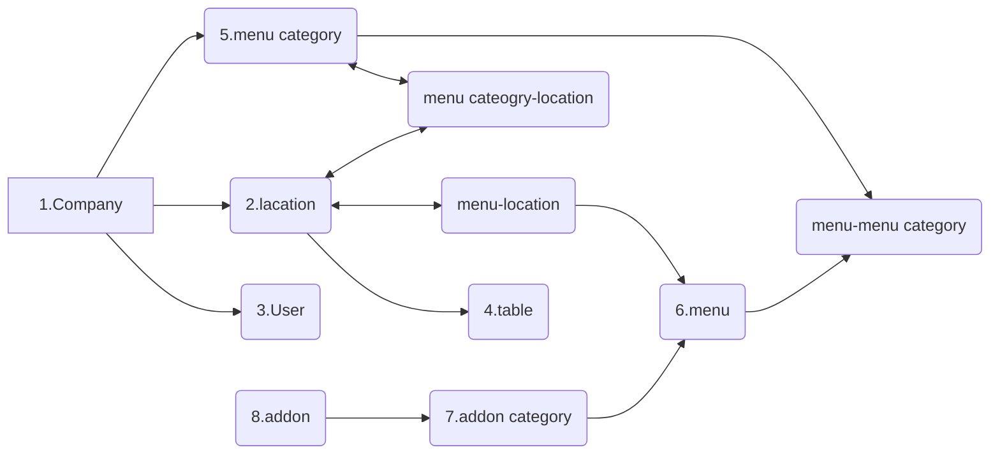

### Data modeling ( data structure )

- Data modeling ဆိုတာက project တစ်ခု မစခင်မှာ
  - data တွေကို စီမံခန့်ခွဲဖို့ အတွက် နည်းလမ်းတွေကို အရင်စဥ်းစားပြီး စီစဥ်ထားတာကို ဆိုလိုတာပါ
  - app တစ်ခုကို release လုပ်ပြီးမှ data model ကို ပြန်လည်ပြင်ဆင်မယ်ဆိုရင် ရှိပြီးသား data တွေ ပျက်သွားနိုင်သလို error လဲ ဖြစ်လာနိုင်တဲ့အတွက် **project တစ်ခု မစခင်မှာ data modeling လုပ်တာက အလွန်ကို အရေးပါတဲ့ အဆင့်တစ်ခု** ဖြစ်ပါတယ်

##

### Example Data modeling for class project ( like Grab/Food Panda app)

### Backoffice app

### Database မိတ်ဆက်( introduce)

database မှာ အဓိကအားဖြင့် SQL database နဲ့ No SQL database ဆိုပြီး နှစ်မျိုးရှိပါတယ်

- ခု သင်တန်းရဲ့ project မှာတော့**_Postgresql_** database ကို အသုံးပြုသွားပါမယ်
- Postgresql ကို Postgres ( ပို့စ်ဂရက်စ်) လို့လဲ ခေါ်ကြပါတယ်။
- SQL database အမျိုးအစားဖြစ်ပြီး data တွေကို table နဲ့ သိမ်းပေးရမှာ ဖြစ်ပါတယ်။
- Postgres ထဲက data တွေကို SQL language နဲ့ ချိတ်ဆက်အသုံးပြုရမှာဖြစ်ပါတယ်။

##

### NodeJS မိတ်ဆက်

#### Node js ဆိုတာ backend (server) မှာ JavaScript ကို အသုံးပြုနိုင်အောင် ပြုလုပ်ပေးတဲ့ အရာ တစ်ခု ဖြစ်ပါတယ်။

- ပုံမှန် ဆိုရင် javascript ကို browserပေါ်မှာသာ runနိုင်ပြီး
- backend ( server ) ပိုင်းမှာ ကျတော့ အခြား programing language တစ်ခုကို အသုံးပြုရပါတယ်။
- node js ကို အသုံးပြုခြင်းအားဖြင့် JavaScript နဲ့ပဲ server မှာ ထိန်းချုပ်နိုင်ပြီး ဖြစ်ပါတယ်။
- node js ကို သုံးပြီး backend server (web server) တစ်ခုကို ဖန်တီးနိုင်ပါတယ်

##

### Web server ( node js HTTP server)

- web server ဆိုတာကတော့ front-end ကနေ ပို့လာတဲ့ request ကို လက်ခံပြီး ၀င်လာတဲ့ request နေ တောင်းခံလာတဲ့ data တွေကို response ပြန်လုပ်ပေးတဲ့ server တစ်ခုလို့ အလွယ် သတ်မှတ်နိုင်ပါတယ်

### နောက် သင်ခန်းစာတွေမှာတော့ nodeJs ကို သုံးပြီး http web server တစ်ခု တည်ဆောက်အသုံးပြုနည်းနဲ့ node js မှာ ရှိပြီးသား method/module/package တစ်ချို့ကို အသုံးပြုနည်းတွေကို လေ့လာကြည့်ကြပါမယ်
